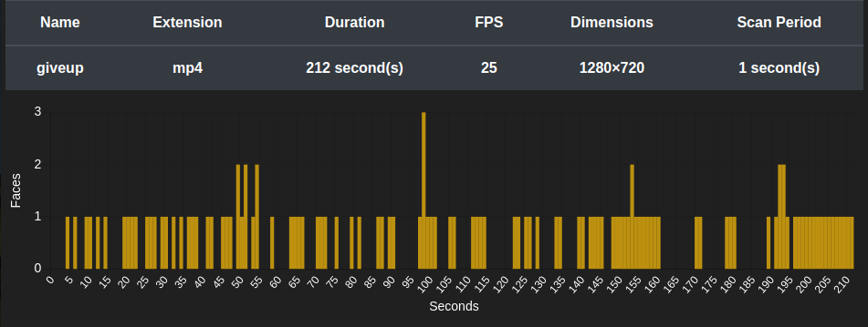

# video-face-count
This is my cs50x final project.
This **Flask** web application uses [ageitgey/face_recognition](https://github.com/ageitgey/face_recognition) library on video frames using a specified scan period. The results are then displayed in a plot.

## Example with this [video](https://www.youtube.com/watch?v=dQw4w9WgXcQ)
### Input

### Output


## Installation

### Clone the repository and install the requirements:
```
git clone https://github.com/molokhovdmitry/video-face-count
cd video-face-count
conda create --name vfc python=3.8
conda activate vfc
pip install -r requirements.txt
conda env config vars set FLASK_APP=VFC
conda deactivate && conda activate
```
### Install ffmpeg:
```
sudo apt-get install ffmpeg
```
If you want you can install the application so it is possible to call it from anywhere.
```
pip install -e .
```
### Launch:
```
flask run
```
Go to http://127.0.0.1:5000/

### Buildpacks for heroku deployment:
```
heroku/python
https://github.com/jonathanong/heroku-buildpack-ffmpeg-latest.git
```
